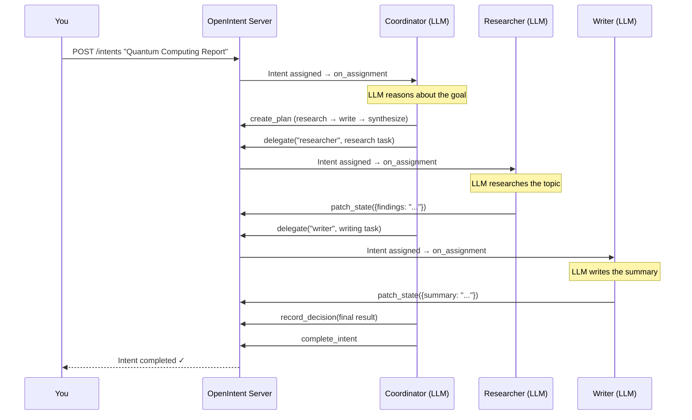

# LLM Quick Start

Build an LLM-powered coordinator that dynamically plans and delegates work — no hardcoded workflow needed.

!!! warning "Requires an API key"
    Set `OPENAI_API_KEY` in your environment before running. Any OpenAI-compatible provider works, or swap to Anthropic, Gemini, etc. via [adapters](../../guide/adapters/).

## 1. Install

```bash
pip install openintent[server] openai
```

Start the server in a separate terminal:

=== "CLI"

    ```bash
    openintent-server
    ```

=== "Programmatic"

    ```python
    from openintent.server import OpenIntentServer
    OpenIntentServer(port=8000).run()
    ```

## 2. Create Worker Agents

Give each agent an LLM brain with `model=`. They use `self.think()` to reason about their tasks autonomously:

```python
# agents.py
from openintent import Agent, on_assignment

@Agent("researcher", model="gpt-5.2")
class Researcher:
    """Researches topics and gathers information."""

    @on_assignment
    async def handle(self, intent):
        return await self.think(intent.description)

@Agent("writer", model="gpt-5.2")
class Writer:
    """Writes polished content from research findings."""

    @on_assignment
    async def handle(self, intent):
        findings = intent.state.get("findings", "")
        return await self.think(
            f"Write a clear summary based on: {findings}"
        )

if __name__ == "__main__":
    Researcher.run()
    Writer.run()
```

!!! tip "`self.think()` under the hood"
    `self.think(prompt)` runs an agentic tool loop — the LLM can call protocol tools (`remember`, `recall`, `escalate`, `update_status`) and returns a structured result. All tool calls are recorded as protocol events automatically.

## 3. Create a Coordinator

The coordinator uses its own LLM to break down goals, delegate tasks to agents, and record decisions. No static YAML workflow required:

```python
# coordinator.py
from openintent import Coordinator, on_assignment

@Coordinator(
    "orchestrator",
    model="gpt-5.2",
    agents=["researcher", "writer"],
    strategy="sequential",
)
class Orchestrator:
    """Plans and delegates work using an LLM."""

    @on_assignment
    async def handle(self, intent):
        # The LLM decides how to break down the goal,
        # which agents to delegate to, and in what order.
        # It has access to: delegate, create_plan,
        # record_decision, and all protocol tools.
        result = await self.think(
            f"""You are coordinating a team to accomplish this goal:
            {intent.title}: {intent.description}

            Available agents: researcher (gathers info), writer (produces content).
            Break this into tasks, delegate to the right agents, and synthesize
            their outputs into a final deliverable."""
        )
        return result

if __name__ == "__main__":
    Orchestrator.run()
```

!!! info "Coordinator protocol tools"
    When `model=` is set on a `@Coordinator`, the LLM automatically gains access to these protocol tools:

    | Tool | Purpose |
    |------|---------|
    | `delegate` | Assign a task to a specific agent |
    | `create_plan` | Break a goal into structured tasks (RFC-0012) |
    | `record_decision` | Log a decision with rationale and evidence |
    | `escalate` | Raise an issue that needs human attention |
    | `remember` / `recall` | Store and retrieve agent memory (RFC-0015) |

## 4. Run It

```bash
# Terminal 1: Server (already running from step 1)

# Terminal 2: Start agents and coordinator
python agents.py &
python coordinator.py &

# Terminal 3: Submit a goal
curl -X POST http://localhost:8000/api/v1/intents \
  -H "Content-Type: application/json" \
  -H "X-API-Key: dev-user-key" \
  -d '{
    "title": "Quantum Computing Report",
    "description": "Research recent quantum computing breakthroughs and write a 500-word executive summary"
  }'
```

## What Happens Under the Hood



Every step is an immutable protocol event — fully auditable, traceable, and reproducible.

## Swap LLM Providers

The `model=` parameter accepts any model supported by the [LLM adapters](../../guide/adapters/):

```python
# Anthropic
@Agent("researcher", model="claude-sonnet-4-20250514")

# Google Gemini
@Agent("researcher", model="gemini-2.0-flash")

# DeepSeek
@Agent("researcher", model="deepseek-chat")

# Azure OpenAI
@Agent("researcher", model="azure/gpt-5.2")
```

Set the corresponding API key (`ANTHROPIC_API_KEY`, `GOOGLE_API_KEY`, etc.) and the adapter handles the rest.

## Next Steps

<div class="oi-features" style="margin-top: 1em;">
  <div class="oi-feature">
    <div class="oi-feature__title">LLM-Powered Agents</div>
    <p class="oi-feature__desc">Deep dive into model=, self.think(), streaming, and protocol-native tools.</p>
    <a href="../../guide/llm-agents/" class="oi-feature__link">Full LLM guide</a>
  </div>
  <div class="oi-feature">
    <div class="oi-feature__title">Coordinators</div>
    <p class="oi-feature__desc">Strategies, guardrails, voting, delegation, and multi-agent orchestration.</p>
    <a href="../../guide/coordinators/" class="oi-feature__link">Coordinator patterns</a>
  </div>
  <div class="oi-feature">
    <div class="oi-feature__title">Task Planning</div>
    <p class="oi-feature__desc">Structured task decomposition with @Plan, checkpoints, and dependency graphs.</p>
    <a href="../../guide/task-planning/" class="oi-feature__link">Plan tasks</a>
  </div>
</div>
