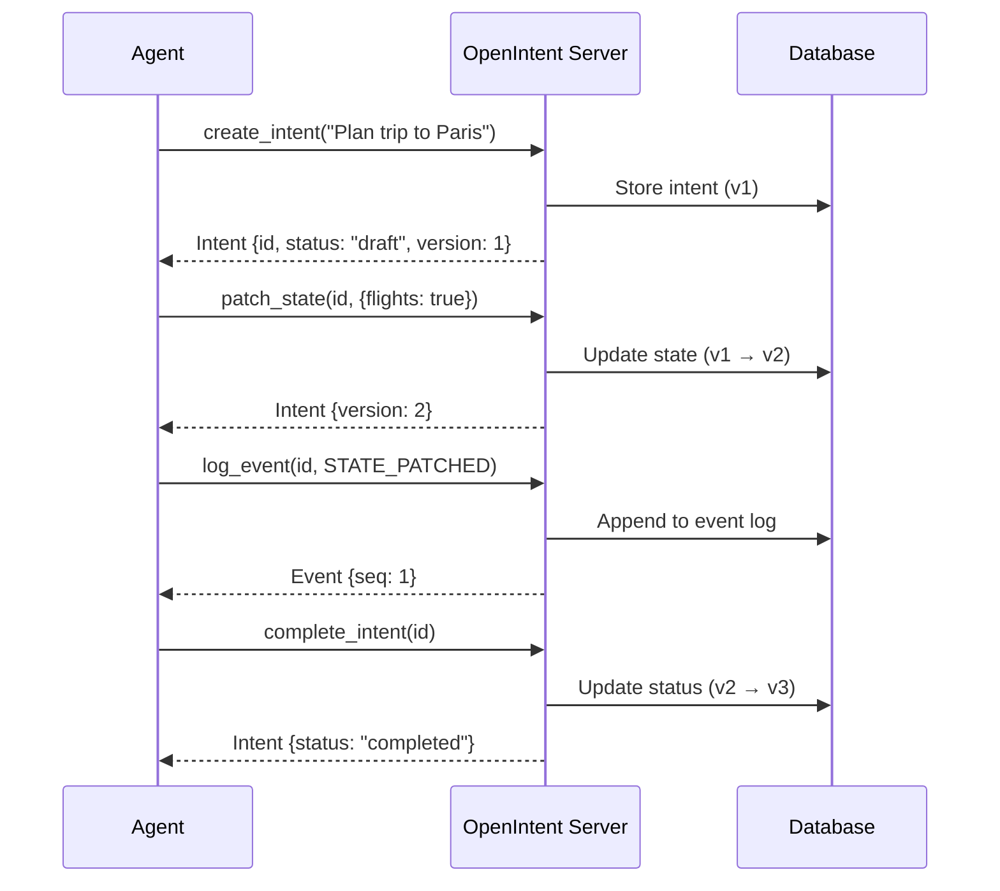

# Quick Start

Get up and running with OpenIntent in under a minute.

## 1. Start a Server

=== "CLI"

    ```bash
    pip install openintent[server]
    openintent-server
    ```

=== "Programmatic"

    ```python
    from openintent.server import OpenIntentServer

    server = OpenIntentServer(
        host="0.0.0.0",
        port=8000,
        database_url="sqlite:///openintent.db"
    )
    server.run()
    ```

!!! info "Server is running"
    The server runs on `http://localhost:8000`. OpenAPI docs are at `/docs`.

## 2. Create Your First Intent

```python
from openintent import OpenIntentClient

client = OpenIntentClient(
    base_url="http://localhost:8000",
    agent_id="my-first-agent"
)

# Create an intent — the fundamental unit of coordination
intent = client.create_intent(
    title="Plan a trip to Paris",
    description="Research flights, hotels, and attractions"
)

print(f"Created: {intent.id}")
print(f"Status:  {intent.status}")   # "draft"
print(f"Version: {intent.version}")  # 1
```

## 3. Update State

State is a flexible key-value store with optimistic concurrency:

```python
updated = client.patch_state(
    intent.id,
    {
        "flights_researched": True,
        "hotels_found": 5,
        "budget_remaining": 2000
    }
)

print(f"Version: {updated.version}")  # 2 (auto-incremented)
```

!!! warning "Concurrency safety"
    State updates use optimistic concurrency control. If two agents try to update the same intent simultaneously, the second will get a `409 Conflict` and can retry with the latest version.

## 4. Log Events

Every action creates an auditable event:

```python
from openintent.models import EventType

client.log_event(
    intent.id,
    EventType.STATE_PATCHED,
    payload={"step": "research", "progress": 0.5}
)
```

## 5. Complete the Intent

```python
completed = client.complete_intent(intent.id)
print(f"Status: {completed.status}")  # "completed"
```

## The Full Picture



## Run the Demo

!!! tip "Interactive demo"
    Try the built-in demo that showcases multi-agent coordination:

    === "Mock mode (no API keys needed)"

        ```bash
        openintent demo
        ```

    === "With real LLM responses"

        ```bash
        OPENAI_API_KEY=sk-... openintent demo
        ```

## Next Steps

<div class="oi-features" style="margin-top: 1em;">
  <div class="oi-feature">
    <div class="oi-feature__title">Agent Abstractions</div>
    <p class="oi-feature__desc">Build full agents with decorators, lifecycle hooks, memory, and tool access.</p>
    <a href="../../guide/agents/" class="oi-feature__link">Build agents</a>
  </div>
  <div class="oi-feature">
    <div class="oi-feature__title">YAML Workflows</div>
    <p class="oi-feature__desc">Define multi-agent pipelines declaratively without writing code.</p>
    <a href="../../guide/workflows/" class="oi-feature__link">Write workflows</a>
  </div>
  <div class="oi-feature">
    <div class="oi-feature__title">LLM Adapters</div>
    <p class="oi-feature__desc">Add automatic observability to OpenAI, Anthropic, Gemini, and 4 more providers.</p>
    <a href="../../guide/adapters/" class="oi-feature__link">Add adapters</a>
  </div>
</div>
