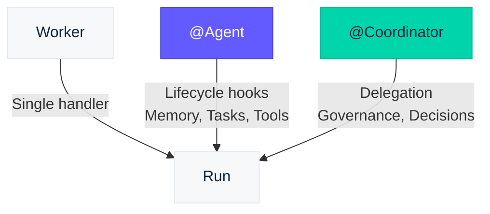
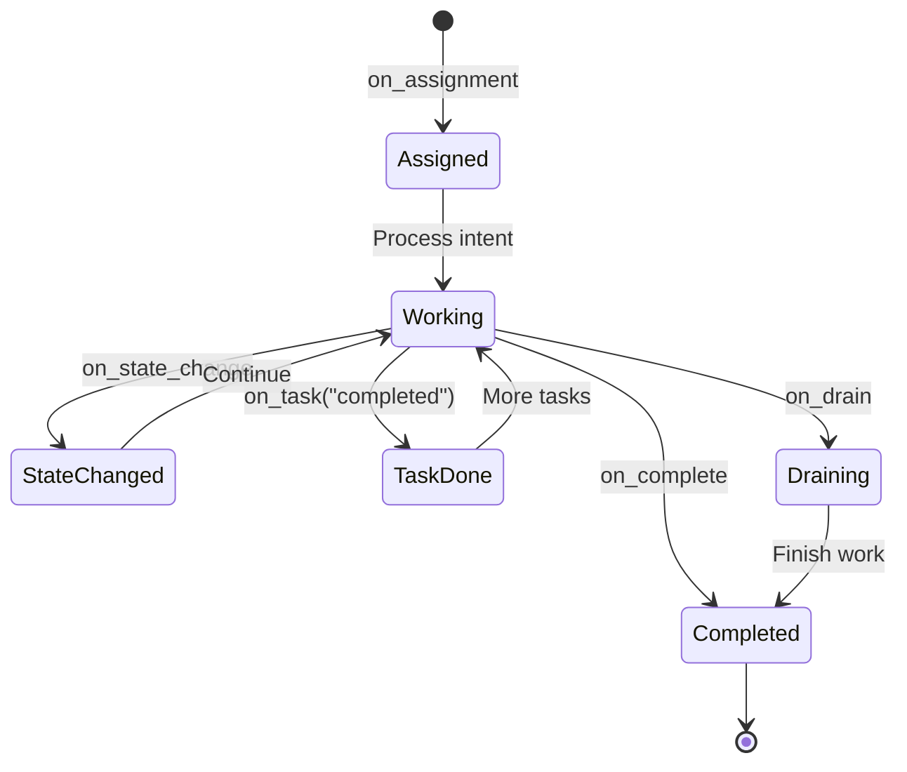

# Agent Abstractions

The `openintent.agents` module provides high-level, decorator-first abstractions for building agents with minimal boilerplate. Decorators and class parameters express protocol semantics so the framework handles the heavy lifting.

## Three Levels of Abstraction

| Level | Class | Best for |
|-------|-------|----------|
| **Simple** | `Worker` | Single-purpose agents with one handler |
| **Standard** | `@Agent` | Full-featured agents with event routing, memory, tools |
| **Complex** | `@Coordinator` | Multi-agent orchestration with governance |



---

## Worker (Simplest)

For single-purpose agents that do one thing well:

```python
from openintent import Worker

async def process(intent):
    return {"result": do_work(intent.title)}

worker = Worker("processor", process)
worker.run()
```

!!! tip "When to use Worker"
    Use `Worker` when your agent has a single responsibility and doesn't need lifecycle hooks, memory, or tools. It's the fastest path from zero to running agent.

---

## @Agent Decorator (Recommended)

Zero-boilerplate agent classes with auto-subscription, state auto-patching, and protocol-managed lifecycle:

```python
from openintent.agents import Agent, on_assignment, on_complete, on_state_change

@Agent(
    "research-agent",
    model: str = None,                # LLM model — enables self.think() (see LLM Agents guide)
    memory: str = "episodic",         # Memory tier: "working", "episodic", or "semantic"
    tools: list = None,               # ToolDef objects or RFC-0014 grant names
    capabilities: list = None,        # Declared capabilities for discovery & routing
    auto_heartbeat: bool = True,      # Automatic heartbeat registration (RFC-0016)
    heartbeat_interval: int = 30,     # Seconds between heartbeats
    drain_timeout: int = 60,          # Seconds to wait during graceful shutdown
    config: AgentConfig = None,       # Full config object (overrides individual args)
)
```

!!! tip "Preferred pattern: LLM-Powered Agents"
    Adding `model=` to `@Agent` is the recommended way to build agents. It gives the agent an LLM brain with an agentic tool loop (`self.think()`), streaming (`self.think_stream()`), and protocol-native tools — all with zero extra wiring. See the [LLM-Powered Agents guide](llm-agents.md) for full details.

```python
@Agent("research-agent")
class ResearchAgent:

    @on_assignment
    async def handle_new_intent(self, intent):
        """Called when assigned to a new intent."""
        return {"status": "researching"}  # Auto-patches state

    @on_state_change(keys=["data"])
    async def on_data_ready(self, intent, old_state, new_state):
        """Called when 'data' key changes in state."""
        analysis = analyze(new_state["data"])
        return {"analysis": analysis}

    @on_complete
    async def handle_completion(self, intent):
        """Called when intent is completed."""
        print(f"Intent {intent.id} completed!")

if __name__ == "__main__":
    ResearchAgent.run()
```

### Agent with Memory and Tools

The `@Agent` decorator accepts configuration that the framework manages automatically:

```python
from openintent.agents import Agent, on_assignment, on_task

@Agent("analyst",
    memory="episodic",           # RFC-0015: auto-configured memory tier
    tools=["web_search", "sql"], # RFC-0014: scoped tool access
    capabilities=["nlp", "sql"], # RFC-0016: registered capabilities
    auto_heartbeat=True,         # RFC-0016: automatic health pings
)
class AnalystAgent:

    @on_assignment
    async def research(self, intent):
        # Recall past findings from episodic memory
        past = await self.memory.recall(tags=["research"])

        findings = await do_research(intent.description, context=past)

        # Store findings for future recall
        await self.memory.store(
            key=f"research-{intent.id}",
            value=findings,
            tags=["research", intent.title]
        )

        return {"findings": findings, "status": "analyzed"}

    @on_task(status="completed")
    async def on_subtask_done(self, intent, task):
        """Called when a subtask completes."""
        return {"last_completed_task": task.title}
```

### Lifecycle Decorators

| Decorator | Trigger | RFC |
|-----------|---------|-----|
| `@on_assignment` | Agent assigned to intent | Core |
| `@on_complete` | Intent completed | Core |
| `@on_state_change(keys)` | State keys changed | Core |
| `@on_event(event_type)` | Specific event type | Core |
| `@on_lease_available(scope)` | Lease becomes available | 0003 |
| `@on_access_requested` | Access request received | 0011 |
| `@on_task(status)` | Task lifecycle event | 0012 |
| `@on_trigger(name)` | Trigger fires | 0017 |
| `@on_drain` | Graceful shutdown signal | 0016 |
| `@on_handoff` | Agent receives work delegated from another agent | 0013 |
| `@on_retry` | Intent reassigned after a previous failure | 0010 |
| `@on_all_complete` | All portfolio intents complete | 0007 |

### Guardrail Decorators

| Decorator | Trigger |
|-----------|---------|
| `@input_guardrail` | Validate intent data before assignment handlers run |
| `@output_guardrail` | Validate handler results before they are committed |

Raise `GuardrailError` to reject:

```python
from openintent.agents import Agent, on_assignment, input_guardrail, GuardrailError

@Agent("safe-agent")
class SafeAgent:

    @input_guardrail
    async def validate(self, intent):
        if intent.state.get("risk_score", 0) > 0.9:
            raise GuardrailError("Risk score too high")

    @on_assignment
    async def work(self, intent):
        return {"status": "processed"}
```



### Memory Access (RFC-0015)

Agents configured with `memory=` get a natural `self.memory` proxy:

```python
@Agent("note-taker", memory="episodic")
class NoteTaker:

    @on_assignment
    async def work(self, intent):
        # Store structured data with tags
        await self.memory.store("key", {"data": "value"}, tags=["notes"])

        # Recall by tags
        results = await self.memory.recall(tags=["notes"])

        # Pin important memories to prevent LRU eviction
        await self.memory.pin("key")
```

!!! info "Three memory tiers"
    - **Working** — task-scoped, auto-archived on completion
    - **Episodic** — agent-scoped, LRU eviction, supports pinning
    - **Semantic** — shared across agents, namespace-level permissions

### Task Decomposition (RFC-0012)

Create and manage subtasks from within agent handlers:

```python
@Agent("planner", memory="working")
class PlannerAgent:

    @on_assignment
    async def plan(self, intent):
        await self.tasks.create(
            title="Research phase",
            parent_intent_id=intent.id,
            assign_to="researcher"
        )
        await self.tasks.create(
            title="Analysis phase",
            parent_intent_id=intent.id,
            depends_on=["research-phase"],
            assign_to="analyst"
        )
        return {"status": "planning", "tasks_created": 2}
```

### Tool Access (RFC-0014)

Agents configured with `tools=` get scoped tool access via `self.tools`:

```python
@Agent("data-agent", tools=["web_search", "sql_query"])
class DataAgent:

    @on_assignment
    async def work(self, intent):
        results = await self.tools.invoke("web_search", query=intent.description)
        return {"search_results": results}
```

!!! warning "Tool scoping"
    Tool grants are scoped per-agent. An agent can only invoke tools it has been explicitly granted access to. Grants support expiry, rate limits, and cascading revocation.

---

## Protocol Decorators

First-class declarative configuration for protocol features. Import from `openintent.agents`:

=== "@Plan (RFC-0012)"

    Declare task decomposition strategy:

    ```python
    from openintent.agents import Agent, Plan, on_assignment

    @Plan(strategy="sequential", checkpoints=True)
    @Agent("pipeline-agent")
    class PipelineAgent:

        @on_assignment
        async def handle(self, intent):
            return {"status": "processing"}
    ```

=== "@Vault (RFC-0014)"

    Declare credential vault requirements:

    ```python
    from openintent.agents import Agent, Vault, on_assignment

    @Vault(name="api-keys", rotation_policy="30d")
    @Agent("secure-agent")
    class SecureAgent:

        @on_assignment
        async def handle(self, intent):
            return {"status": "authenticated"}
    ```

=== "@Memory (RFC-0015)"

    Declare memory tier configuration:

    ```python
    from openintent.agents import Agent, Memory, on_assignment

    @Memory(tier="episodic", capacity=1000, eviction="lru")
    @Agent("learning-agent")
    class LearningAgent:

        @on_assignment
        async def handle(self, intent):
            past = await self.memory.recall(tags=["similar"])
            return {"context_used": len(past)}
    ```

=== "@Trigger (RFC-0017)"

    Declare reactive scheduling:

    ```python
    from openintent.agents import Agent, Trigger, on_trigger

    @Trigger(type="schedule", cron="0 9 * * *")
    @Agent("morning-agent")
    class MorningAgent:

        @on_trigger(name="daily-check")
        async def daily_report(self, intent):
            return {"report": "generated"}
    ```

---

## Messaging (`@on_message`)

Agents can communicate directly through **channels** — scoped message streams attached to an intent. The `@on_message` decorator routes incoming messages to handler methods. Return a dict from the handler to auto-reply.

```python
from openintent.agents import Agent, on_assignment, on_message

@Agent("data-agent")
class DataAgent:

    @on_assignment
    async def handle(self, intent):
        return {"status": "ready"}

    @on_message(channel="data-sync")
    async def answer_questions(self, message):
        """Called when a message arrives on the data-sync channel."""
        if message.message_type == "request":
            return {"answer": "v2.3", "confidence": 0.95}

    @on_message()  # No filter — receives all messages
    async def log_all(self, message):
        print(f"[{message.sender}] {message.payload}")
```

### Channel Proxy

Every `@Agent` has a `self.channels` proxy for sending messages:

```python
@Agent("researcher")
class ResearchAgent:

    @on_assignment
    async def handle(self, intent):
        ch = await self.channels.open("data-sync", intent_id=intent.id)

        # Ask a question and wait for the answer
        response = await ch.ask("data-agent", {
            "question": "What schema version?"
        }, timeout=30)

        schema = response.payload["answer"]

        # Notify a specific agent
        await ch.notify("logger", {"phase": "research", "started": True})

        # Broadcast to all channel members
        await ch.broadcast({"status": "analysis starting", "schema": schema})

        return {"findings": f"Using schema {schema}"}
```

| Method | Description |
|--------|-------------|
| `channels.open(name, intent_id)` | Open or create a channel |
| `channel.ask(to, payload, timeout)` | Send request and await response |
| `channel.notify(to, payload)` | Fire-and-forget message |
| `channel.broadcast(payload)` | Send to all members |
| `channel.send(to, type, payload)` | Low-level send |

!!! tip "Declarative channels"
    Define channels in YAML workflows instead of creating them programmatically. The framework creates channels automatically at workflow start. See the [Messaging guide](messaging.md) and [Workflows guide](workflows.md#channels).

---

## @Coordinator Decorator

Multi-agent orchestration with governance features:

```python
@Coordinator(
    coordinator_id: str,              # Unique identifier for this coordinator
    model: str = None,                # LLM model — enables self.think() for planning & delegation
    agents: list = None,              # Agent IDs managed by this coordinator
    strategy: str = "sequential",     # "sequential", "parallel", "adaptive"
    guardrails: list = None,          # Guardrail rules applied to all delegated work
    memory: str = "episodic",         # Memory tier: "working", "episodic", or "semantic"
    tools: list = None,               # ToolDef objects or RFC-0014 grant names
    capabilities: list = None,        # Declared capabilities for discovery
    auto_heartbeat: bool = True,      # Automatic heartbeat registration
    config: AgentConfig = None,       # Full config object (overrides individual args)
)
```

### Built-in Coordinator Guardrails

The `guardrails=` parameter on `@Coordinator` accepts these built-in policies:

| Policy | Description |
|--------|-------------|
| `"require_approval"` | Logs decision records before assignment |
| `"budget_limit"` | Rejects intents exceeding cost constraints |
| `"agent_allowlist"` | Rejects delegation to agents outside the managed list |

### LLM-Powered Coordinator

Add `model=` and the coordinator can autonomously plan, delegate, and make decisions:

```python
from openintent import Coordinator, on_assignment

@Coordinator(
    "project-lead",
    model="claude-sonnet-4-20250514",
    agents=["researcher", "writer", "reviewer"],
    memory="episodic",
    guardrails=["require_approval"],
)
class ProjectLead:
    @on_assignment
    async def plan(self, intent):
        return await self.think(
            f"Break down this project and delegate to your team: "
            f"{intent.description}"
        )
```

See [LLM-Powered Agents](llm-agents.md#llm-powered-coordinators) for full coordinator LLM details.

### Manual Coordinator Example

```python
from openintent.agents import (
    Coordinator, on_conflict, on_escalation, on_quorum
)

@Coordinator("team-lead",
    agents=["agent-a", "agent-b"],
    strategy="parallel",
    guardrails=["require_approval"],
)
class TeamCoordinator:

    @on_conflict
    async def handle_conflict(self, intent, conflict):
        """Called on version conflicts."""
        await self.record_decision(
            decision_type="conflict_resolution",
            summary=f"Resolved conflict on {intent.id}",
            rationale="Latest write wins"
        )

    @on_escalation
    async def handle_escalation(self, intent, source_agent):
        """Called when an agent escalates."""
        await self.delegate(intent.title, agents=["senior-agent"])

    @on_quorum(threshold=0.6)
    async def on_vote_reached(self, intent, votes):
        """Called when 60% of agents agree."""
        await self.record_decision(
            decision_type="quorum",
            summary="Consensus reached",
            rationale=f"{len(votes)} votes in favor"
        )
```

### Coordinator Lifecycle Decorators

| Decorator | Trigger |
|-----------|---------|
| `@on_conflict` | Version conflict detected |
| `@on_escalation` | Agent escalation received |
| `@on_quorum(threshold)` | Voting threshold met |

### Coordinator Methods

| Method | Description |
|--------|-------------|
| `self.think(prompt)` | Agentic tool loop — sends prompt to LLM, executes tool calls, returns final text (requires `model=`) |
| `self.think_stream(prompt)` | Same agentic loop but yields tokens as they arrive (requires `model=`) |
| `self.delegate(title, agents)` | Delegate work to agents |
| `self.record_decision(...)` | Record governance decision |
| `self.decisions` | Access decision audit log |

---

## Running Agents

=== "Blocking"

    ```python
    ResearchAgent.run()
    ```

=== "Async"

    ```python
    import asyncio
    asyncio.run(agent.run_async())
    ```

## Next Steps

<div class="oi-features" style="margin-top: 1em;">
  <div class="oi-feature">
    <div class="oi-feature__title">LLM Adapters</div>
    <p class="oi-feature__desc">Add automatic observability to 7 LLM providers with streaming hooks.</p>
    <a href="../adapters/" class="oi-feature__link">Add adapters</a>
  </div>
  <div class="oi-feature">
    <div class="oi-feature__title">Built-in Server</div>
    <p class="oi-feature__desc">Run your own OpenIntent server with one command.</p>
    <a href="../server/" class="oi-feature__link">Start a server</a>
  </div>
  <div class="oi-feature">
    <div class="oi-feature__title">API Reference</div>
    <p class="oi-feature__desc">Complete reference for all agent classes, decorators, and methods.</p>
    <a href="../../api/agents/" class="oi-feature__link">View API</a>
  </div>
</div>
