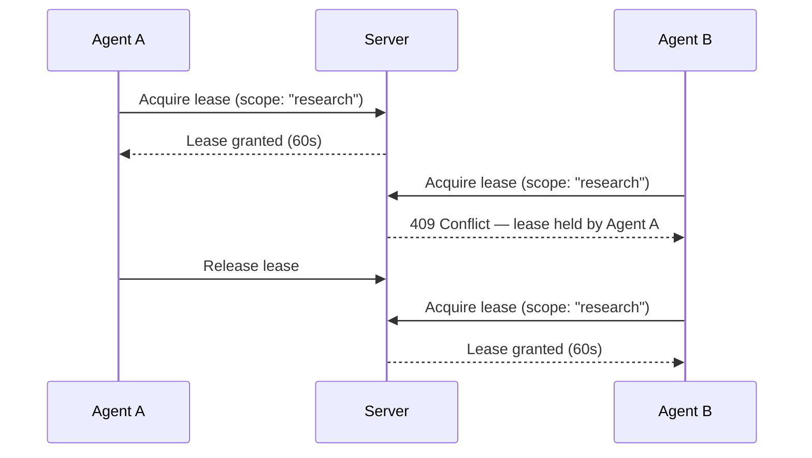

# Leasing & Concurrency

Leasing assigns temporary ownership of an intent scope to a specific agent, preventing collisions when multiple agents work on the same intent. This is defined in [RFC-0003](../rfcs/0003-agent-leasing.md).

## Why Leasing?

Without leasing, two agents could modify the same data simultaneously, causing lost updates and inconsistent state. Leases make ownership explicit and bounded by time.



## Acquiring a Lease

```python
from openintent import OpenIntentClient

client = OpenIntentClient(
    base_url="http://localhost:8000",
    api_key="dev-user-key",
    agent_id="worker-1"
)

# Acquire a lease on a specific scope
lease = client.acquire_lease(
    intent_id=intent.id,
    scope="data_processing",
    ttl_seconds=120  # Lease expires after 2 minutes
)

print(f"Lease {lease.id} acquired, expires at {lease.expires_at}")
```

### Lease Scopes

Scopes are arbitrary strings that partition an intent's work. Only one agent can hold a lease on a given scope at a time.

| Example Scope | Use Case |
|---------------|----------|
| `"research"` | Only one agent researches at a time |
| `"hotel_search"` | Exclusive access to hotel booking |
| `"write"` | Prevent simultaneous edits |
| `"*"` | Exclusive access to the entire intent |

## Working Under a Lease

The lease context manager acquires and releases automatically:

```python
from openintent.agents import Agent, on_assignment, on_lease_available

@Agent("exclusive-worker")
class ExclusiveWorker:

    @on_assignment
    async def handle(self, intent):
        async with self.lease(intent.id, scope="processing", ttl=60):
            # Only this agent can work on "processing" scope
            result = await do_exclusive_work(intent)
            return {"result": result}
        # Lease is automatically released here

    @on_lease_available("research")
    async def claim_research(self, intent, scope):
        """Called when a research lease becomes available."""
        async with self.lease(intent.id, scope):
            findings = await research(intent.description)
            return {"findings": findings}
```

## Lease Lifecycle

| Status | Description |
|--------|-------------|
| `active` | Lease is held by an agent |
| `released` | Agent voluntarily released the lease |
| `expired` | TTL elapsed without renewal |
| `revoked` | Governance action terminated the lease |

## Renewing Leases

For long-running work, renew before expiry:

```python
# Manual renewal
lease = client.acquire_lease(intent.id, scope="analysis", ttl_seconds=60)

# ... do some work ...

# Extend the lease
renewed = client.renew_lease(intent.id, lease.id, ttl_seconds=60)
print(f"New expiry: {renewed.expires_at}")
```

## Handling Conflicts

When a lease is already held, the server returns a 409 Conflict:

```python
from openintent.exceptions import ConflictError

try:
    lease = client.acquire_lease(intent.id, scope="research", ttl_seconds=60)
except ConflictError:
    print("Another agent holds this lease — waiting...")
```

## Listing Active Leases

```python
# Get all leases for an intent
leases = client.get_leases(intent.id)

for lease in leases:
    print(f"Scope: {lease.scope}, Agent: {lease.agent_id}, "
          f"Status: {lease.status}, Expires: {lease.expires_at}")
```

!!! tip "Automatic heartbeats"
    When using `@Agent(auto_heartbeat=True)`, the framework automatically renews leases for you. See [Agent Lifecycle](lifecycle.md) for details.

## Next Steps

- [Governance & Arbitration](governance.md) — Escalation and decision records
- [Agent Abstractions](agents.md) — Use `@on_lease_available` in agents
