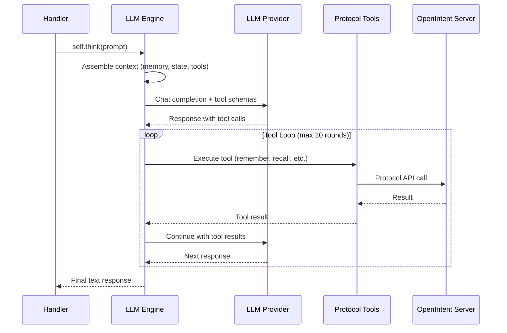

# LLM-Powered Agents

!!! tip "Preferred pattern"
    Adding `model=` to `@Agent` or `@Coordinator` is the recommended way to build agents. It gives the agent an LLM brain with an agentic tool loop, streaming, and protocol-native tools — all with zero extra wiring. An LLM is not always needed, but when it fits, this is the pattern to use.

Add `model=` to any `@Agent` or `@Coordinator` decorator and the agent gains an LLM brain. The agent can reason about tasks, call protocol tools (memory, escalation, delegation), and stream responses --- all without leaving the OpenIntent protocol.

## Quick Start

```python
from openintent import Agent, on_assignment

@Agent("analyst", model="gpt-5.2", memory="episodic")
class Analyst:
    @on_assignment
    async def work(self, intent):
        return await self.think(intent.description)
```

That single `model=` parameter wires up:

- **`self.think(prompt)`** --- send a prompt through an agentic tool loop and get a result
- **`self.think_stream(prompt)`** --- same loop, but yields tokens as they arrive
- **`self.reset_conversation()`** --- clear conversation history for a fresh context

The agent automatically has access to protocol-native tools: it can store and recall memories, update intent state, escalate issues, and request human clarification --- all through standard function calling.

---

## How It Works



The LLM Engine sits between your handler and the LLM provider. It:

1. **Assembles context** from the agent's memory, current intent state, and tool schemas
2. **Sends a chat completion** request with protocol tools registered as function-calling tools
3. **Executes tool calls** the LLM makes (storing memories, updating state, etc.)
4. **Loops** until the LLM returns a text response (or hits the max rounds limit)
5. **Returns** the final text to your handler

---

## Configuration

### Basic Parameters

| Parameter | Default | Description |
|-----------|---------|-------------|
| `model` | --- | Model identifier (e.g. `gpt-5.2`, `claude-sonnet-4-20250514`) |
| `provider` | auto-detected | Provider name; inferred from model if omitted |
| `system_prompt` | auto-generated | Custom system instructions |
| `temperature` | `0.7` | Sampling temperature |
| `max_tokens` | `4096` | Maximum tokens per response |
| `max_tool_rounds` | `10` | Maximum tool-call iterations per `think()` |
| `planning` | `False` (Agent) / `True` (Coordinator) | Enable planning mode in system prompt |
| `stream_by_default` | `False` | Default streaming behavior |

### Provider Auto-Detection

The SDK infers the provider from the model name:

| Model prefix | Provider |
|-------------|----------|
| `gpt-` | `openai` |
| `claude-` | `anthropic` |
| `gemini-` | `gemini` |
| `grok-` | `grok` |
| `deepseek-` | `deepseek` |
| Contains `/` | `openrouter` |
| Other | `openai` (default) |

Override with `provider=`:

```python
@Agent("my-agent", model="my-fine-tune", provider="openai")
class MyAgent:
    ...
```

### API Keys

The engine reads API keys from environment variables by provider:

| Provider | Environment variable |
|----------|---------------------|
| OpenAI | `OPENAI_API_KEY` |
| Anthropic | `ANTHROPIC_API_KEY` |
| Google Gemini | `GOOGLE_API_KEY` |
| xAI Grok | `XAI_API_KEY` |
| DeepSeek | `DEEPSEEK_API_KEY` |
| OpenRouter | `OPENROUTER_API_KEY` |

Or pass explicitly:

```python
@Agent("bot", model="gpt-5.2", llm_api_key="sk-...")
class Bot:
    ...
```

---

## Protocol Tools

When the LLM processes a prompt, it can call built-in protocol tools through standard function calling. These tools are protocol-native --- they map directly to OpenIntent API operations.

### Agent Tools

Every LLM-powered agent has access to:

| Tool | Description | Protocol mapping |
|------|-------------|-----------------|
| `remember` | Store a key-value pair in agent memory | RFC-0015 Memory |
| `recall` | Query agent memory by keyword | RFC-0015 Memory |
| `update_status` | Patch the current intent's state | RFC-0001 State |
| `clarify` | Ask a human for clarification | RFC-0003 Arbitration |
| `escalate` | Escalate the intent to a supervisor | RFC-0003 Governance |

### Coordinator Tools

Coordinators get the agent tools plus:

| Tool | Description | Protocol mapping |
|------|-------------|-----------------|
| `delegate` | Assign work to a managed agent | RFC-0013 Governance |
| `create_plan` | Decompose work into sub-tasks | RFC-0012 Planning |
| `record_decision` | Log a governance decision | RFC-0013 Decisions |

### How Tools Execute

```python
@Agent("researcher", model="gpt-5.2", memory="episodic")
class Researcher:
    @on_assignment
    async def work(self, intent):
        result = await self.think(
            "Research this topic and remember key findings: "
            + intent.description
        )
        return {"analysis": result}
```

When the LLM decides to call `remember`, the engine:

1. Parses the tool call from the LLM response
2. Executes `agent.memory.store(key, value)` via the protocol API
3. Returns the result to the LLM as a tool response
4. The LLM continues reasoning with the tool result

The agent never needs to handle tool execution manually.

### Custom Tools

Beyond protocol tools, you can give agents access to your own custom tools.
The `ToolDef` class and `@define_tool` decorator let you define tools with rich
descriptions, structured parameter schemas, and local callable handlers
that the LLM can invoke through standard function calling.

#### Using the `@define_tool` Decorator

The simplest way to define a tool:

```python
from openintent import Agent, define_tool, on_assignment

@define_tool(description="Search the web and return top results.", parameters={
    "type": "object",
    "properties": {
        "query": {"type": "string", "description": "Search query."},
        "max_results": {"type": "integer", "description": "Max results to return."},
    },
    "required": ["query"],
})
async def web_search(query: str, max_results: int = 5) -> dict:
    # Your search implementation here
    return {"results": ["result1", "result2"]}

@Agent("researcher", model="gpt-5.2", tools=[web_search])
class Researcher:
    @on_assignment
    async def work(self, intent):
        return await self.think(
            "Research this topic: " + intent.description
        )
```

The `@define_tool` decorator creates a `ToolDef` object from your function:

- **`name`** defaults to the function name (override with `name=`)
- **`description`** tells the LLM what the tool does
- **`parameters`** defines the JSON Schema for the arguments the LLM should provide
- **`handler`** is your function --- called locally when the LLM invokes the tool

#### Using the `ToolDef` Class Directly

For more control, create `ToolDef` objects directly:

```python
from openintent import Agent, ToolDef, on_assignment

calculator = ToolDef(
    name="calculator",
    description="Evaluate a mathematical expression and return the result.",
    parameters={
        "type": "object",
        "properties": {
            "expression": {
                "type": "string",
                "description": "A mathematical expression like '2 + 3 * 4'.",
            },
        },
        "required": ["expression"],
    },
    handler=lambda expression: {"result": eval(expression)},
)

@Agent("math-tutor", model="gpt-5.2", tools=[calculator])
class MathTutor:
    @on_assignment
    async def work(self, intent):
        return await self.think(intent.description)
```

#### Mixing Tool Types

You can pass any combination of `ToolDef` objects and plain strings:

```python
@Agent("hybrid", model="gpt-5.2", tools=[web_search, calculator, "legacy_api"])
class HybridAgent:
    pass
```

- **`ToolDef` objects** --- rich schema + local handler, executed directly
- **Plain strings** --- resolved via the protocol's tool grant system (RFC-0014)

#### How Tool Descriptions Reach the LLM

Each `ToolDef`'s `description` and `parameters` are passed directly to the LLM
as function-calling schemas. The better your descriptions and parameter
schemas, the more accurately the LLM will use your tools.

For OpenAI-style providers, the schema maps to the `tools` array in the
chat completion API. For Anthropic, it maps to the `tools` array with
`input_schema`. The SDK handles the format conversion automatically.

#### Execution Priority

When the LLM calls a tool, the engine resolves it in order:

1. **Protocol tools** (remember, recall, clarify, etc.) --- always take priority
2. **Local handlers** (`ToolDef` objects with a `handler` function) --- executed in-process
3. **Remote protocol grants** (plain string names) --- resolved via RFC-0014

#### Automatic Tracing

Local tool invocations are automatically traced as protocol events when the
agent is connected to an OpenIntent server. Each call records the tool name,
arguments, result, and execution duration. Tracing is best-effort — it never
blocks or fails the tool execution, even if the server is unreachable.

!!! note "Backwards compatibility"
    The previous names `Tool` and `@tool` still work as aliases and will not be removed.

---

## Streaming

### Token-by-Token Streaming

Use `self.think_stream()` to get an async generator that yields tokens:

```python
@Agent("writer", model="gpt-5.2")
class Writer:
    @on_assignment
    async def work(self, intent):
        tokens = []
        async for token in await self.think_stream(intent.description):
            tokens.append(token)
            print(token, end="", flush=True)
        return {"result": "".join(tokens)}
```

### Callback-Based Streaming

Pass `on_token=` to `self.think()`:

```python
@Agent("narrator", model="gpt-5.2")
class Narrator:
    @on_assignment
    async def work(self, intent):
        result = await self.think(
            intent.description,
            stream=True,
            on_token=lambda t: print(t, end=""),
        )
        return {"narration": result}
```

!!! note "Tool loop and streaming"
    During the tool loop phase, the engine runs non-streaming completions internally. Streaming only applies to the **final** response after all tool calls are resolved.

---

## Human-in-the-Loop

The `clarify` tool enables structured human-in-the-loop flows:

```python
@Agent("careful-agent", model="gpt-5.2")
class CarefulAgent:
    @on_assignment
    async def work(self, intent):
        result = await self.think(
            "Analyze this request. If anything is ambiguous, "
            "use the clarify tool to ask the user: "
            + intent.description
        )
        return {"result": result}
```

When the LLM calls `clarify`:

1. An **arbitration request** is created (RFC-0003)
2. The intent is **paused**, waiting for human input
3. `think()` returns a JSON response with `status: "awaiting_response"`
4. When the human responds, the answer is injected into the conversation context
5. The agent resumes reasoning with the clarification

This keeps humans in control of ambiguous decisions while letting the LLM handle routine work autonomously.

---

## LLM-Powered Coordinators

Coordinators with `model=` get delegation and planning tools:

```python
from openintent import Coordinator, on_assignment

@Coordinator(
    "project-lead",
    model="gpt-5.2",
    agents=["researcher", "writer", "reviewer"],
    memory="episodic",
)
class ProjectLead:
    @on_assignment
    async def plan(self, intent):
        return await self.think(
            f"Break down this project and delegate to your team: "
            f"{intent.description}"
        )
```

The LLM can:

- **Delegate** tasks to managed agents via the `delegate` tool
- **Create plans** that decompose work into sub-tasks via `create_plan`
- **Record decisions** for audit trails via `record_decision`
- **Recall** past decisions and context from memory

!!! tip "Planning defaults"
    Coordinators have `planning=True` by default, which adds planning guidance to the system prompt. Agents default to `planning=False`.

---

## Context Assembly

The engine automatically builds rich context for the LLM from protocol state:

### What Gets Included

| Source | Condition | Content |
|--------|-----------|---------|
| System prompt | Always | Agent identity, role, available tools |
| Custom prompt | If `system_prompt=` set | User-provided instructions |
| Intent context | If `intent=` passed | Title, description, current state |
| Memory | If `memory=` configured | Recent memories from RFC-0015 |
| Conversation history | Accumulated | Prior exchanges in this session |
| Tool schemas | Always | Function-calling definitions |
| Managed agents | Coordinators only | List of delegable agents |
| Planning mode | If enabled | Planning guidance |

### Conversation History

The engine maintains conversation history across `think()` calls within a session. Reset it with:

```python
self.reset_conversation()
```

---

## Combining with Manual Logic

LLM-powered agents can mix `self.think()` with manual protocol operations:

```python
from openintent import Agent, define_tool, on_assignment

@define_tool(description="Search the web for information.", parameters={
    "type": "object",
    "properties": {
        "query": {"type": "string", "description": "Search query."},
    },
    "required": ["query"],
})
async def web_search(query: str) -> dict:
    return {"results": ["..."]}

@Agent("hybrid", model="gpt-5.2", memory="episodic", tools=[web_search])
class HybridAgent:
    @on_assignment
    async def work(self, intent):
        analysis = await self.think(
            f"Analyze this requirement: {intent.description}"
        )

        await self.patch_state(intent.id, {
            "analysis": analysis,
            "status": "analyzed",
        })

        plan = await self.think(
            "Based on your analysis, create an implementation plan."
        )

        return {"analysis": analysis, "plan": plan}
```

The conversation history carries over between `think()` calls, so the second call has full context from the first.

---

## Complete Example

```python
from openintent import Agent, Coordinator, on_assignment, on_all_complete

@Agent("researcher", model="gpt-5.2", memory="episodic")
class Researcher:
    @on_assignment
    async def work(self, intent):
        result = await self.think(
            f"Research this topic thoroughly. Remember key findings. "
            f"Topic: {intent.description}"
        )
        return {"research": result}

@Agent("writer", model="claude-sonnet-4-20250514", memory="episodic")
class Writer:
    @on_assignment
    async def work(self, intent):
        result = await self.think(
            f"Write a clear, well-structured report based on: "
            f"{intent.description}"
        )
        return {"report": result}

@Coordinator(
    "editor",
    model="gpt-5.2",
    agents=["researcher", "writer"],
    memory="episodic",
)
class Editor:
    @on_assignment
    async def plan(self, intent):
        return await self.think(
            f"You are managing a research-to-report pipeline. "
            f"Delegate research first, then writing. "
            f"Topic: {intent.description}"
        )

    @on_all_complete
    async def review(self, portfolio):
        return await self.think(
            "Review all completed work and provide a final summary."
        )
```

---

## Error Handling

The engine handles errors gracefully:

- **Tool execution errors** are returned to the LLM as error messages so it can retry or adjust
- **Max tool rounds exceeded** returns the last available content
- **Provider errors** propagate as exceptions from `think()`
- **Missing API keys** raise clear error messages at initialization

```python
@Agent("safe-agent", model="gpt-5.2")
class SafeAgent:
    @on_assignment
    async def work(self, intent):
        try:
            return await self.think(intent.description)
        except Exception as e:
            await self.escalate(intent.id, f"LLM error: {e}")
            return {"error": str(e)}
```
