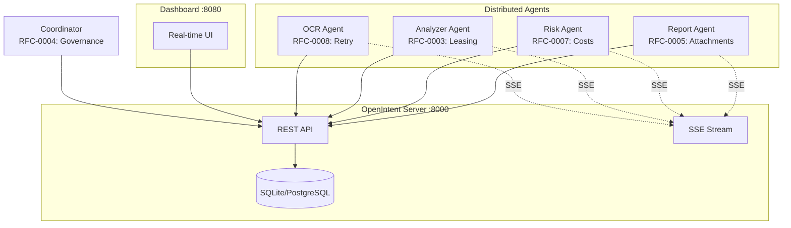
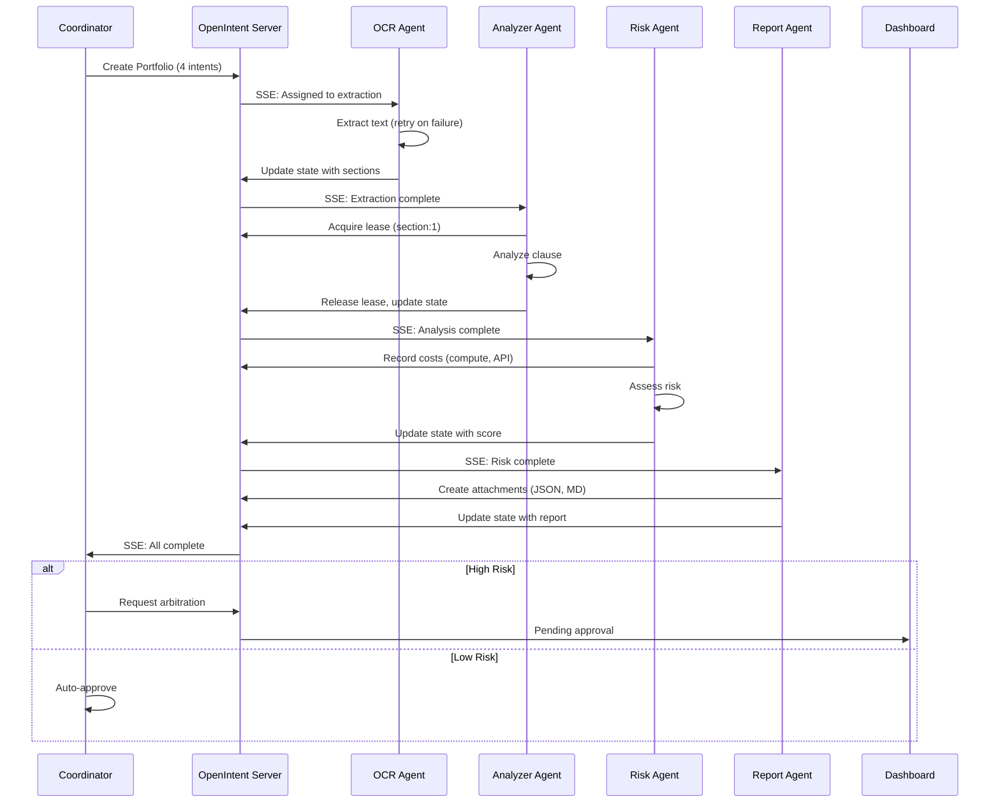

# Compliance Document Review

> **A complete showcase of all 8 OpenIntent RFCs working together.**

This example demonstrates a real-world compliance document review workflow where multiple distributed agents coordinate through a central OpenIntent server to extract, analyze, assess, and report on legal documents.

## Architecture



## Workflow



## RFC Coverage

| RFC | Feature | Agent | How It's Used |
|-----|---------|-------|---------------|
| 0001 | Intents | All | Each phase is an intent with state |
| 0002 | Events | All | Immutable audit log of all actions |
| 0003 | Leasing | Analyzer | Exclusive access to document sections |
| 0004 | Governance | Coordinator | Human approval for high-risk docs |
| 0005 | Attachments | Report | JSON and Markdown report files |
| 0006 | Subscriptions | All | Real-time SSE event streaming |
| 0007 | Costs | Risk | Compute and API cost tracking |
| 0008 | Retry | OCR | Exponential backoff on failures |

## Quick Start

### 1. Start the OpenIntent Server

```bash
cd reference-implementation
pip install -e ".[server]"
openintent-server
```

Server runs at http://localhost:8000

### 2. Start the Dashboard

```bash
pip install fastapi uvicorn
python examples/compliance_review/dashboard/app.py
```

Dashboard runs at http://localhost:8080

### 3. Start the Agents (4 terminals)

**Terminal 1 - OCR Agent:**
```bash
python examples/compliance_review/agents/ocr_agent.py
```

**Terminal 2 - Analyzer Agent:**
```bash
python examples/compliance_review/agents/analyzer_agent.py
```

**Terminal 3 - Risk Agent:**
```bash
python examples/compliance_review/agents/risk_agent.py
```

**Terminal 4 - Report Agent:**
```bash
python examples/compliance_review/agents/report_agent.py
```

### 4. Run a Compliance Review

```bash
python examples/compliance_review/coordinator.py --document "Service Agreement 2024"
```

### 5. Watch the Dashboard

Open http://localhost:8080 to see:
- Intents being created and progressing
- Events updating automatically (3-second polling)
- Leases being acquired and released
- Costs accumulating
- Attachments being created
- Governance decisions (approve/reject high-risk docs)

Note: The dashboard uses REST API polling for updates (every 3 seconds). For true real-time updates, agents use SSE subscriptions directly from the OpenIntent server.

## File Structure

```
compliance_review/
  agents/
    ocr_agent.py        # RFC-0008: Retry policies
    analyzer_agent.py   # RFC-0003: Leasing
    risk_agent.py       # RFC-0007: Cost tracking
    report_agent.py     # RFC-0005: Attachments
  dashboard/
    app.py              # FastAPI dashboard server
    templates/
      index.html        # Real-time dashboard UI
  coordinator.py        # RFC-0004: Governance gates
  config.py             # Shared configuration
  README.md             # This file
```

## The Code

### Coordinator with Governance (35 lines core)

```python
from openintent import Coordinator, PortfolioSpec, IntentSpec, on_all_complete

class ComplianceCoordinator(Coordinator):
    async def plan(self, document_name):
        return PortfolioSpec(
            name=f"Compliance: {document_name}",
            governance_policy={"require_approval_for_high_risk": True},
            intents=[
                IntentSpec("Extraction", assign="ocr-agent"),
                IntentSpec("Analysis", assign="analyzer-agent", 
                          depends_on=["Extraction"]),
                IntentSpec("Risk", assign="risk-agent", 
                          depends_on=["Analysis"]),
                IntentSpec("Report", assign="report-agent", 
                          depends_on=["Risk"]),
            ],
        )

    @on_all_complete
    async def finalize(self, portfolio):
        # Check if governance approval needed
        if high_risk:
            await self.client.request_arbitration(intent_id, ...)
```

### Agent with Leasing (15 lines core)

```python
from openintent import Agent, on_assignment

@Agent("analyzer-agent")
class AnalyzerAgent:
    @on_assignment
    async def analyze(self, intent):
        for section in sections:
            # Exclusive access to this section
            lease = await self.client.acquire_lease(
                intent_id=intent.id,
                scope=f"section:{section.id}",
            )
            
            result = analyze_section(section)
            
            await self.client.release_lease(intent.id, lease.id)
        
        return {"analysis": results}
```

### Agent with Cost Tracking (10 lines core)

```python
@Agent("risk-agent")
class RiskAgent:
    @on_assignment
    async def assess(self, intent):
        # Record compute costs
        await self.client.record_cost(
            intent_id=intent.id,
            cost_type="compute",
            amount=0.002,
            currency="USD",
        )
        
        return {"risk": calculate_risk()}
```

## Dashboard Features

The dashboard provides visibility into all OpenIntent data via REST API polling:

- **Intents Panel**: Shows all intents with status badges
- **Events Panel**: Live stream of all events (RFC-0002)
- **Leases Panel**: Active leases and their holders (RFC-0003)
- **Costs Panel**: Total spend with breakdown by type (RFC-0007)
- **Attachments Panel**: Generated reports and files (RFC-0005)
- **Governance Panel**: Approve/reject high-risk documents (RFC-0004)
- **State Panel**: Full JSON view of intent state

## Configuration

```bash
# Server location
export OPENINTENT_URL="http://localhost:8000"

# API key
export OPENINTENT_API_KEY="dev-agent-key"

# Dashboard port
export DASHBOARD_PORT="8080"
```

## Simulated vs Real

This example uses **simulated** document processing:
- OCR extracts predefined sections
- Analysis finds sample compliance issues
- Risk calculates scores from issue severity
- Reports generate structured output

To use **real** processing:
1. Integrate actual OCR (Tesseract, AWS Textract)
2. Connect to LLMs for analysis (GPT-4, Claude)
3. Use your risk scoring models

The OpenIntent coordination layer remains the same - just swap the business logic inside each agent.

## Why OpenIntent?

Without OpenIntent, this workflow requires:
- Message queues (Redis, RabbitMQ)
- Shared database for state
- Custom polling/webhooks
- Manual lease implementation
- Separate audit logging
- Custom cost tracking
- Bespoke governance flows

With OpenIntent:
- One central server
- Declarative workflow definition
- Built-in SSE subscriptions
- Native leasing support
- Automatic event logging
- Integrated cost tracking
- First-class governance

**Result**: 4 agents, 1 coordinator, 200 lines of business logic total.

## Learn More

- [OpenIntent Protocol](https://openintent.ai)
- [SDK Documentation](../../README.md)
- [Multi-Agent Example](../multi_agent/README.md)
- [Agent Examples](../agents/README.md)
