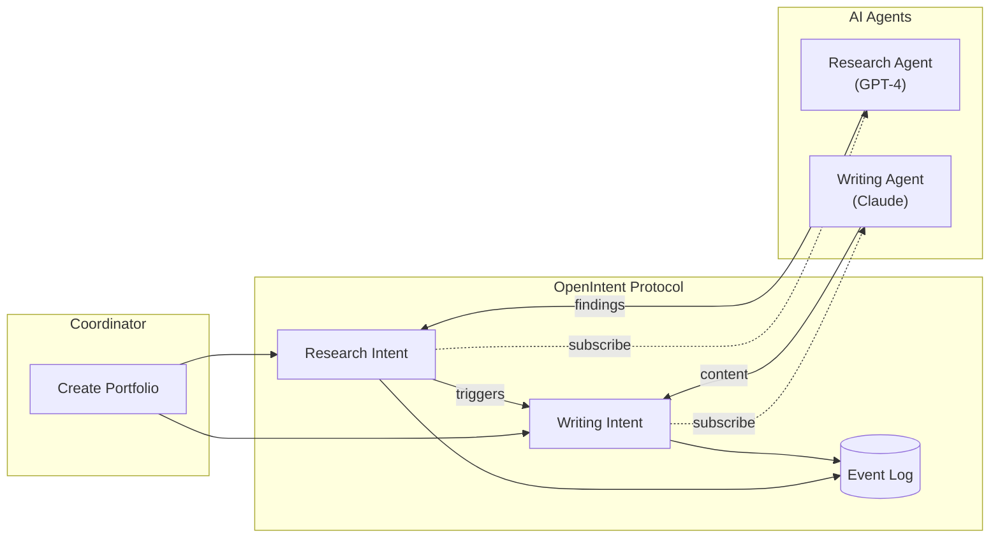
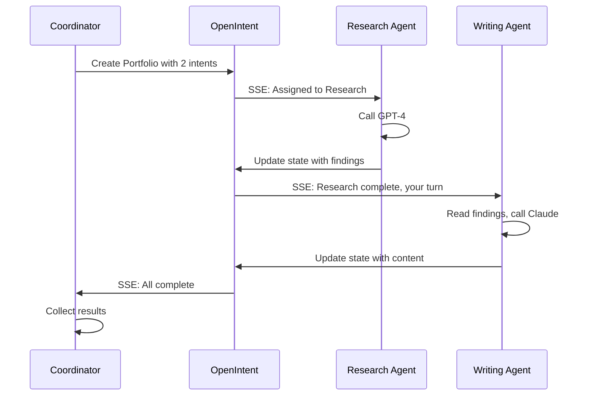
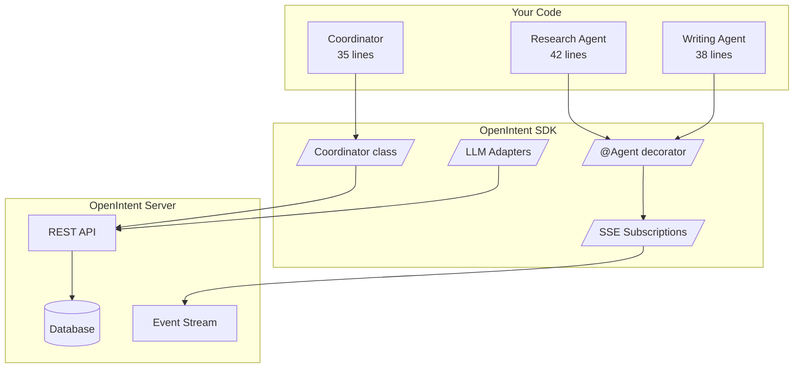

# Multi-Agent Coordination with OpenIntent

> **The simplest way to coordinate AI agents from different providers.**

This example shows how OpenIntent dramatically simplifies multi-agent coordination. Two AI agents - OpenAI's GPT-4 and Anthropic's Claude - work together through a shared protocol, with all the complex coordination handled automatically.

## The Problem

Coordinating multiple AI agents is hard:

- Different APIs and authentication
- No standard way to pass work between agents
- Race conditions and state conflicts
- No visibility into what happened

## The Solution

OpenIntent provides a **shared coordination layer** that makes multi-agent systems as simple as writing single-agent code:



## Quick Start

### 1. Start the OpenIntent Server

```bash
pip install openintent[server]
openintent-server
```

### 2. Start the Agents (in separate terminals)

**Terminal 1 - Research Agent (GPT-4):**
```bash
export OPENAI_API_KEY="sk-..."
python examples/multi_agent/research_agent.py
```

**Terminal 2 - Writing Agent (Claude):**
```bash
export ANTHROPIC_API_KEY="sk-ant-..."
python examples/multi_agent/writing_agent.py
```

### 3. Run the Coordinator

**Terminal 3:**
```bash
python examples/multi_agent/coordinator.py --task "Write a blog post about AI agent coordination"
```

## How It Works



## The Code

### Research Agent (42 lines of logic)

```python
from openintent import Agent, on_assignment

@Agent("research-agent")
class ResearchAgent:
    @on_assignment
    async def research(self, intent):
        # Your research logic here
        findings = await call_gpt4(intent.description)
        
        # Return value auto-patches intent state
        return {"research": {"findings": findings}}

ResearchAgent.run()
```

### Writing Agent (38 lines of logic)

```python
from openintent import Agent, on_assignment

@Agent("writing-agent")  
class WritingAgent:
    @on_assignment
    async def write(self, intent):
        # Read research from intent state
        research = intent.state.get("research", {})
        
        # Your writing logic here
        content = await call_claude(research["findings"])
        
        return {"content": {"text": content}}

WritingAgent.run()
```

### Coordinator (35 lines of logic)

```python
from openintent import Coordinator, PortfolioSpec, IntentSpec

class ContentCoordinator(Coordinator):
    async def plan(self, topic):
        return PortfolioSpec(
            name=f"Content: {topic}",
            intents=[
                IntentSpec(
                    title="Research Phase",
                    assign="research-agent",
                ),
                IntentSpec(
                    title="Writing Phase", 
                    assign="writing-agent",
                    depends_on=["Research Phase"],  # Auto-waits
                ),
            ],
        )

# Execute and wait for all to complete
result = await coordinator.execute(spec)
```

## What OpenIntent Handles For You

| Feature | Without OpenIntent | With OpenIntent |
|---------|-------------------|-----------------|
| Agent Communication | Custom queues, webhooks, polling | Automatic via SSE |
| State Management | Shared database, manual sync | Structured intent state |
| Race Conditions | Manual locking, retries | Optimistic concurrency |
| Visibility | Custom logging, dashboards | Immutable event log |
| Dependencies | Manual orchestration | Declarative `depends_on` |
| Error Handling | Try/catch everywhere | Centralized governance |

## Architecture



## File Structure

```
multi_agent/
  coordinator.py      # Orchestrates the workflow
  research_agent.py   # GPT-4 research agent
  writing_agent.py    # Claude writing agent
  config.py           # Simple configuration
  README.md           # This file
```

## Key Concepts

### 1. Declarative Workflows

Define what you want, not how to coordinate it:

```python
PortfolioSpec(
    intents=[
        IntentSpec(title="A", assign="agent-a"),
        IntentSpec(title="B", assign="agent-b", depends_on=["A"]),
        IntentSpec(title="C", assign="agent-c", depends_on=["A", "B"]),
    ]
)
```

### 2. Automatic Event Routing

The `@Agent` decorator handles subscription, event parsing, and routing:

```python
@Agent("my-agent")
class MyAgent:
    @on_assignment
    async def work(self, intent): ...
    
    @on_complete  
    async def cleanup(self, intent): ...
    
    @on_state_change(["progress"])
    async def track(self, intent, old, new): ...
```

### 3. LLM Adapters

Automatic logging of all LLM interactions:

```python
from openintent.adapters import OpenAIAdapter

adapter = OpenAIAdapter(openai_client, client, intent_id)
response = adapter.chat.completions.create(...)  # Auto-logged
```

## Comparison: Before and After

### Before (without OpenIntent)

```python
# 200+ lines of coordination boilerplate
class Coordinator:
    def __init__(self):
        self.redis = Redis()
        self.db = Database()
        
    async def run_workflow(self, task):
        # Create work items
        research_id = await self.db.create_task(...)
        await self.redis.publish("tasks", research_id)
        
        # Poll for completion
        while True:
            status = await self.db.get_status(research_id)
            if status == "complete":
                break
            await asyncio.sleep(1)
        
        # Get results, handle errors, retry logic...
        research = await self.db.get_result(research_id)
        
        # Create next phase
        writing_id = await self.db.create_task(...)
        await self.redis.publish("tasks", writing_id)
        
        # More polling, error handling, state sync...
```

### After (with OpenIntent)

```python
# 35 lines of business logic
class ContentCoordinator(Coordinator):
    async def plan(self, topic):
        return PortfolioSpec(
            name=topic,
            intents=[
                IntentSpec("Research", assign="research-agent"),
                IntentSpec("Writing", assign="writing-agent", 
                          depends_on=["Research"]),
            ],
        )

result = await coordinator.execute(spec)
```

## Configuration

### Environment Variables

```bash
# OpenIntent server
export OPENINTENT_URL="http://localhost:8000"
export OPENINTENT_API_KEY="dev-agent-key"

# LLM providers
export OPENAI_API_KEY="sk-..."
export ANTHROPIC_API_KEY="sk-ant-..."
```

## Troubleshooting

**Agents not receiving assignments?**
- Check agents are subscribed: look for "Waiting for assignments via SSE..."
- Verify the agent ID matches what's in the `IntentSpec.assign`

**Timeout errors?**
- Increase timeout: `--timeout 600`
- Check LLM API keys are valid
- Ensure network connectivity to OpenAI/Anthropic

**State not passing between agents?**
- Research agent must return data in the expected format
- Writing agent reads from `intent.state`

## Learn More

- [OpenIntent Protocol Specification](https://openintent.ai/docs)
- [SDK Documentation](../../README.md)
- [High-Level Agent Examples](../agents/README.md)

## License

MIT - See the main project license.
